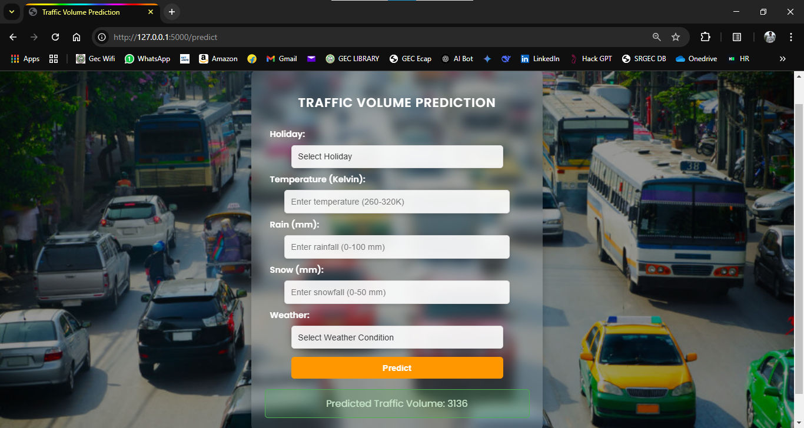

<<<<<<< HEAD
# 🚦 Traffic Intelligence: Advanced Traffic Volume Estimation  

## **📌 Overview**  
**Traffic Intelligence** is an AI-powered system for **traffic volume estimation** based on **historical traffic data, weather conditions, and time-based patterns**. The model helps in **traffic management, urban planning, and real-time congestion prediction**.  

## **📂 Project Structure**  
```
Traffic-Intelligence/
│── models/                   # Trained model files  
│   ├── best_model.pkl  
│   ├── encoder_holiday.pkl  
│   ├── encoder_weather.pkl  
│   ├── imputer.pkl  
│   ├── scaler.pkl  
│── static/                   # Static assets (CSS, JS, etc.)  
│   ├── style.css  
│── templates/                # HTML templates for Flask app  
│   ├── index.html  
│   ├── result.html  
│── Analysis_Images/          # Stores visualized insights from the data  
│   ├── correlation_heatmap.png  
│   ├── missing_values.png  
│   ├── pair_plot.png  
│   ├── traffic_volume_distribution.png  
│   ├── traffic_vs_weather.png  
│   ├── weather_conditions.png  
│── dataset/                  # Raw traffic data  
├── traffic_volume.csv
│── .gitignore                # Ignore unnecessary files  
│── app.py                    # Flask web application  
│── dataset_summary.txt       # Summary of dataset statistics  
│── model_analysis.py         # Data analysis and visualization script  
│── traffic_model.py          # Machine learning model for traffic prediction  
│── traffic_volume.csv        # Dataset file  
│── requirements.txt          # Python dependencies  
│── Sample.png                # Sample visualization output  
│── README.md                 # Project documentation (this file)  
```

## **📊 Sample Output**  
Below is a **sample visualization** generated from the model:  

  

## **📥 Dataset**  
The dataset includes:  
- **Date & Time:** Timestamp of traffic record  
- **Weather Conditions:** Clear, Cloudy, Rain, Snow, etc.  
- **Temperature (K):** Temperature in Kelvin  
- **Precipitation (Rain/Snow):** Recorded in mm  
- **Traffic Volume:** Number of vehicles passing through the checkpoint  

## **📌 How to Use**  

### **1️⃣ Install Dependencies**  
```bash
pip install -r requirements.txt
```

### **2️⃣ Run Data Analysis**  
```bash
python model_analysis.py
```
This script will process the dataset, clean missing values, and generate visualizations inside **Analysis_Images/**.

### **3️⃣ Train the Model & Predict Traffic**  
```bash
python traffic_model.py
```
This trains a machine learning model to predict traffic volume based on weather and time.

### **4️⃣ Run the Flask Web App (Optional)**  
```bash
python app.py
```
This will start the **Flask-based UI** where you can input conditions and get traffic predictions.  

---

## **🛠 Technologies Used**  
- **Python (Pandas, NumPy, Matplotlib, Seaborn, Scikit-learn)**  
- **Machine Learning (Regression Models, Time-Series Forecasting)**  
- **Flask (For Web Integration - Optional)**  

## **📬 Contact & Contributions**  
For any questions or contributions, feel free to Contact us.
=======
# Traffic-Volume-Estimation
>>>>>>> 7e1c0ef5e1d5e9cf3a50691eec61b0ac97e8ee73
